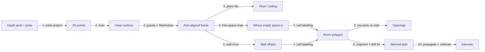

# LiDAR floor-plan method

Pipeline: **pixels → 3D points → fused surface → planes → walls → room polygon → openings → stitched rooms → intervals.**

---

## 1. Back-projection

Depth pixel $(u,v)$ with depth $z$ (mm → m). Intrinsics in `camera_matrix.csv` are for the 1920×1440 RGB image; scale to the 256×192 depth image with $s = 256/1920$:

$$
\mathbf p_c = z\begin{bmatrix}(u-c_x')/f_x' \\ (v-c_y')/f_y' \\ 1\end{bmatrix},\qquad f'=s f,\; c'=s c
$$

World frame using the per-frame pose $(\mathbf t, q)$ from `odometry.csv`:

$$
\mathbf p_w = R(q)\,\mathbf p_c + \mathbf t
$$

Convention verified on `single_room`: OpenCV camera axes (x right, y down, z forward) produce a sharp floor plane; the ARKit convention smears it. World +y is up (gravity-aligned by ARKit).

Filters: confidence = 2, $0.2 < z < 4$ m. Weight $w = 1/\sigma_z(z)^2$ (noise grows with range).

Normals come for free from the organised depth grid: $\mathbf n = \partial_u \mathbf p_c \times \partial_v \mathbf p_c$, normalised, rotated by $R(q)$.

## 2. Fusion

TSDF (Curless & Levoy 1996; KinectFusion 2011):

$$
D(\mathbf x)=\frac{\sum_i w_i\,\psi\big(z_i(\pi_i(\mathbf x)) - [T_i^{-1}\mathbf x]_z\big)}{\sum_i w_i}
$$

Surface at $D=0$. Averaging $N$ observations reduces random noise by $\sqrt N$. First implementation: weighted voxel averaging (same effect on planar surfaces, no dependency on Open3D).

## 3. Gravity + Manhattan frame

Gravity: ARKit world y is gravity-aligned (roll/pitch are observable from the IMU and do not drift).

Manhattan yaw from horizontal normal angles $\phi_i$ (4-fold symmetric, closed form):

$$
\theta^*=\tfrac14\,\operatorname{atan2}\Big(\sum_i w_i\sin 4\phi_i,\;\sum_i w_i\cos 4\phi_i\Big)
$$

Rotate by $-\theta^*$ about y → walls become $x=\text{const}$ or $z=\text{const}$.

## 4. Floor, ceiling, ceiling height

Least-squares plane: $\bar{\mathbf p}=\tfrac1N\sum\mathbf p_i$, $C=\tfrac1N\sum(\mathbf p_i-\bar{\mathbf p})(\mathbf p_i-\bar{\mathbf p})^\top$, $\mathbf n$ = eigenvector of $\lambda_{\min}$. RANSAC iterations $k=\frac{\log(1-p)}{\log(1-w^3)}$.

$$
H = d_{\text{ceil}} - d_{\text{floor}},\qquad \sigma_H^2=\sigma_{d_f}^2+\sigma_{d_c}^2+\sigma_{\text{sys}}^2
$$

$\sigma_d$ is estimated by **block bootstrap over frame chunks**, not $\sigma/\sqrt N$ (points within a frame share pose error, so they are not independent).

Gates: bias $\bar H - H_{gt} \le 1.5$ cm; repeatability $|H_1-H_2| \le 1$ cm. Report which failure mode applies.

If the ceiling is not observed, $H$ is reported as `null` with a warning, never guessed.

## 5. Free-space map

2D top-down grid (2 cm). Each ray marks traversed cells **free**, its endpoint **occupied**. Log-odds update:

$$
\ell_t(c)=\ell_{t-1}(c)+\log\frac{p(\text{occ}\mid z_t)}{1-p(\text{occ}\mid z_t)}-\ell_0
$$

Only rays whose endpoints lie in the **upper height band** (≈1.4 m to ceiling − 0.1 m) are used: they pass over furniture, so furniture cannot shrink the footprint. Points beyond a confident wall are mirror/glass artefacts.

## 6. Walls

Upper-band points with normals along ±x → histogram of x → peaks are walls (same for z). Keep peaks with ≥ 1 m vertical support. Refine offset by robust mean; $\sigma$ by block bootstrap.

Wall length is set by the two perpendicular walls that bound it:

$$
L = |b_2-b_1|,\qquad \sigma_L=\sqrt{\sigma_{b_1}^2+\sigma_{b_2}^2}
$$

## 7. Room polygon: cell complex + graph cut

Extend all wall lines → arrangement of rectangular cells. Label each cell inside ($y_c=1$) / outside:

$$
E(\mathbf y)=\sum_c A_c\big[y_c(1-f_c)+(1-y_c)f_c\big] + \lambda\!\!\sum_{(c,c')}\!\!\ell_{cc'}(1-s_{cc'})\,[y_c\neq y_{c'}]
$$

$f_c$ = free fraction of cell, $s_{cc'}$ = wall support on the shared edge of length $\ell_{cc'}$. Submodular → exact global optimum by min-cut (Mura 2016; Oesau 2014; Ochmann 2019 ILP variant).

## 8. Openings

Per wall, a 2D grid in wall coordinates (along-wall $s$ × height $h$, 2 cm). Ray labelling (Adan & Huber 2011): **occupied** (points within ±τ of plane), **empty** (rays passed through the plane), **unknown** (never observed). Empty if through-ratio ≥ 0.7 with ≥ $m$ observations. Door: touches floor, height > 1.8 m. Window: sill > 0.3 m. Unknown cells are never declared openings (prevents phantom openings).

Sub-cm width from jamb planes:

$$
W=s_R-s_L,\qquad \sigma_W=\sqrt{\sigma_{s_L}^2+\sigma_{s_R}^2}
$$

## 9. Multi-room + drift

Segmentation (implemented, `geometry/rooms.py`): each wall line gets a **closed profile** along its length:

- closed where there is **high-band** wall evidence (≥ 1.2 m above floor, so furniture cannot fake a wall);
- closed across gaps of ≤ 1.0 m that are bounded on both sides by wall or a perpendicular wall (corner): these are **doorways**, provided the line carries ≥ 0.6 m of wall evidence;
- wider or unbounded gaps stay open (open plan, a room continuing).

Inside cells connect only across edges that are < 50 % closed; connected components are rooms (rooms < 1 m² merge into their largest neighbour). Doorway gaps between two different rooms become `door` openings; rooms sharing closed edges or separated by a thin (< 35 cm) outside strip are adjacent via `wall`. Morphological erosion (Bormann 2016) was tried first and rejected: it cannot tell a 1 m hallway from a 1 m opening.

Refinements (from scan2/scan3):

- **Evidence band 1.2–1.95 m** above the floor: above furniture, below door heads. Using evidence up to the ceiling let lintels close every doorway in a 3.1 m-high flat.
- **Near-duplicate faces** (same facing, < 8 cm apart: skirting, frames, drift) fold into the strongest face.
- **Furniture vs wall**: a face ≤ 2.5 m long is furniture when the same wall is seen 0.2–1.0 m behind it *and* continuing above the face's top. Ceiling reach alone fails: most real walls were only scanned to 1.5–2.7 m of a 3.1 m ceiling.
- **Doors through thick walls**: room lookup hops a thin wall strip, so a doorway in a 10–17 cm wall connects the rooms on both sides.
- **Camera-path doors**: wherever the walking path crosses a wall line between two rooms, the nearest coverage gap (≥ 0.4 m) is a doorway; a person cannot walk through a wall.
- **Wall bodies and thickness**: thin outside strips between rooms are wall bodies; their width is reported as wall thickness (measured 10.5–17 cm on scan3).
- **Per-room ceiling height** from downward-facing points above each room; falls back to the property ceiling.

Drift: VIO has 4 unobservable DOF (yaw + xyz), so correct 4 DOF per fragment.

(a) Pose graph with loop closure (Choi, Zhou, Koltun 2015):

$$
\min_{\{T_i\}}\sum_{(i,j)}\rho\Big(\big\|\log(Z_{ij}^{-1}T_i^{-1}T_j)^\vee\big\|^2_{\Lambda_{ij}}\Big)
$$

(b) Plane-anchored correction (Kaess 2015):

$$
\min_{\delta\theta_i,\,\delta t_i}\sum_{i,k}\sum_{\mathbf p\in P_{ik}}\big(\mathbf n_k^\top(R_{\delta\theta_i}\mathbf p+\mathbf t_i+\delta\mathbf t_i)-d_k\big)^2
$$

Ablation: `--drift off|on`; metrics = footprint error vs ground truth and wall sharpness (point spread about each wall plane).

## 10. Intervals and calibration

Propagate: $\sigma_y^2 = J\Sigma J^\top$ + systematic floor. Calibrate per tier and measurement type with split conformal:

$$
r_i=\frac{|\hat y_i-y_i|}{\sigma_i},\qquad \hat q=\text{Quantile}_{\lceil (n+1)(1-\alpha)\rceil/n}\{r_i\},\qquad \hat y\pm\hat q\,\sigma
$$

Report empirical coverage per tier.

## 11. Outputs

- `result.json`: rooms (polygon, walls with length ± interval, area, ceiling), openings (connects, host walls, width), adjacency.
- `plan.png`: top-down plan. Drawn with +z pointing down the page: the frame is right-handed and y-up, so plotting +z upwards would mirror the plan.
- `plan3d.glb`: lightweight 3-D model (glTF 2.0, a few KB): extruded walls to ceiling height, door cut-outs with lintels, per-room floor slabs. Heights not measured are flagged `assumed` in `result.json`. Opens in Windows 3D Viewer, Blender, or any glTF viewer.

## Measurement definitions (must match the tape)

| Quantity | Definition |
|---|---|
| Wall length | Inner face to inner face at ~1 m height (above skirting) |
| Ceiling height | Floor to ceiling at room centre (below cornice) |
| Opening width | Clear width, jamb to jamb |

---

## References

**Core (implemented):**
- Okorn et al., *Toward Automated Modeling of Floor Plans*, 3DPVT 2010.
- Adan & Huber, *3D Reconstruction of Interior Wall Surfaces under Occlusion and Clutter*, 3DIMPVT 2011.
- Turner & Zakhor, *Floor Plan Generation and Room Labeling of Indoor Environments from Laser Range Data*, GRAPP 2014.
- Oesau, Lafarge & Alliez, *Indoor Scene Reconstruction using Feature Sensitive Primitive Extraction and Graph-cut*, ISPRS 2014.
- Mura, Mattausch & Pajarola, *Piecewise-planar Reconstruction of Multi-room Interiors with Arbitrary Wall Arrangements*, CGF 2016.
- Ochmann, Vock & Klein, *Automatic Reconstruction of Fully Volumetric 3D Building Models from Oriented Point Clouds*, ISPRS J. 2019.
- Schnabel, Wahl & Klein, *Efficient RANSAC for Point-Cloud Shape Detection*, CGF 2007.
- Bormann et al., *Room Segmentation: Survey, Implementation, and Analysis*, ICRA 2016.
- Curless & Levoy, *A Volumetric Method for Building Complex Models from Range Images*, SIGGRAPH 1996.
- Newcombe et al., *KinectFusion*, ISMAR 2011.
- Choi, Zhou & Koltun, *Robust Reconstruction of Indoor Scenes*, CVPR 2015.
- Kaess, *Simultaneous Localization and Mapping with Infinite Planes*, ICRA 2015.
- Coughlan & Yuille, *Manhattan World*, ICCV 1999.
- Angelopoulos & Bates, *A Gentle Introduction to Conformal Prediction and Distribution-Free Uncertainty Quantification*, 2021.

**Learned floor-plan methods (not used for LiDAR: 256² density maps ≈ several cm/pixel, cannot meet 1–2 cm gates):**
- FloorNet — https://arxiv.org/abs/1804.00090
- Floor-SP — https://arxiv.org/abs/1908.06702
- MonteFloor — https://arxiv.org/abs/2103.11161
- HEAT — https://arxiv.org/abs/2111.15143
- RoomFormer — https://arxiv.org/abs/2211.15658
- PolyRoom — https://arxiv.org/abs/2407.10439
- SceneScript — https://arxiv.org/abs/2403.13064

**Data / later tiers:**
- ARKitScenes (iPhone/iPad LiDAR + laser-scanner GT) — https://arxiv.org/abs/2111.08897
- VGGT — https://arxiv.org/abs/2503.11651
