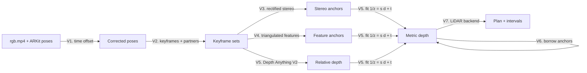

# Video floor-plan method

Video tier: **RGB video + ARKit poses → metric depth per keyframe → shared LiDAR backend (METHOD.md §2–§11) → plan.**

Inputs: `rgb.mp4` plus ARKit poses and intrinsics (`odometry.csv`, `camera_matrix.csv`). `depth/`, `confidence/` and `imu.csv` are never read. **Metric scale comes from ARKit** (camera + IMU), never from a learned model. A learned model supplies only the *shape* of each depth map.



Commands:

```powershell
python -m roomscan run scan3 --tier video --out out/scan3_video                       # default: --video-depth mono
python -m roomscan run scan3 --tier video --video-depth stereo --out out/scan3_stereo  # classical-only ablation
python scripts/eval_video_depth.py scan3 [mono|stereo]                                 # depth vs LiDAR (evaluation only)
python scripts/compare_tiers.py out/scan3 out/scan3_video                              # plan vs LiDAR plan
```

Code: `io/stray.py` (`PosedVideo`), `geometry/stereo.py`, `geometry/monodepth.py`, `video.py`.

---

## V1. Pose time offset

Stray poses do not line up exactly with the video frames. Poses are evaluated at $t_i+\delta$ (SLERP for rotation, linear for position). $\delta$ minimises the median epipolar distance of SIFT matches over ~80 keyframe pairs from the first 3000 frames, using the video only:

$$
\delta^*=\arg\min_{\delta\in[-50,50]\,\text{ms}}\ \operatorname{median}_{\text{pairs}}\ \operatorname{median}_{\text{matches}}\ \frac{|\tilde{\mathbf x}_b^\top F_{ab}(\delta)\,\tilde{\mathbf x}_a|}{\|(F_{ab}(\delta)\,\tilde{\mathbf x}_a)_{1:2}\|}
$$

Grid of 4 ms steps, refined by a parabola through the minimum. Found $\delta\approx+19$ ms on all three dev captures. The epipolar error halves (scan3: 2.3 → 1.2 px at 640 px).

## V2. Keyframes and partners

- **Keyframes:** the least motion-blurred frame in each window of 10 frames. Blur is estimated from the poses alone: angular speed + linear speed / 2 m.
- **Stereo partners** (V3): within ±90 frames; baseline 0.10–0.45 m (target 0.25 m); optical axes < 20° apart; baseline not along the view direction ($|\hat{\mathbf b}\cdot\hat{\mathbf z}|<0.7$). Up to 4 candidates; the second differs in side or direction from the first.
- **Triangulation neighbours** (V4): within ±120 frames; baseline 0.08–0.8 m; axes < 35° apart; spread in time (> 10 frames apart).

## V3. Rectified stereo (classical anchors)

1. **Rectification** (Fusiello): the new x axis is the baseline, so the keyframe is always the left image, including vertical sweeps.
2. **Row fix:** ARKit relative poses leave ~1 px of row misalignment. A row-only affine $v' = v + c_0 + c_1u + c_2v$, fitted to SIFT matches (median residual ≤ 0.6 px), removes it. **Horizontal disparity, and therefore scale, is left to ARKit.** A two-view essential matrix cannot resolve it at these baselines: its rotations differed from ARKit by ~2° while still fitting the matches (bas-relief ambiguity).
3. **SGBM** at 640 px (160 disparities). The disparity is resampled onto the keyframe's own pixel grid.
4. **Two-pair agreement:** depth is kept where two partner pairs agree within 3 % + 1 cm.

Stereo alone is accurate where it exists (median 2.8 % single_room, 6.2 % scan3 vs LiDAR), but only **~3 % of pixels survive**. The captures were recorded for LiDAR: fast sweeps (median 0.64 rad/s, heavy blur), close views of **blank walls**, and rotation-dominant motion. Stereo alone is too sparse to form walls, so `--video-depth stereo` stops at "Too few walls".

## V4. Triangulated feature anchors

SIFT matches between the keyframe and each triangulation neighbour are triangulated with the ARKit projection matrices $P = K[R^\top \mid -R^\top C]$. A point is kept if:

- depth > 0.3 m in both views;
- reprojection error < 1.5 px in both views;
- parallax between the two rays > 2°.

## V5. Dense relative depth, made metric

**Model:** Depth Anything V2 Small (ONNX, Apache-2.0, SHA-256 pinned in `monodepth.py`). It runs on the CPU at ~0.33 s per 504×378 frame. Its output $d$ is affine-invariant inverse depth: shape only.

**Fit per keyframe** to the metric anchors (V3 stereo pixels + V4 triangulated points):

$$
\frac1z = s\,d + t
$$

- 2-point RANSAC; an anchor is an inlier if its relative depth error is < 5 %.
- Then least squares on the inliers, weighted for relative error: $\min \sum (s\,d_i z_i + t\,z_i - 1)^2$.
- **Accept** if there are ≥ 30 anchors, ≥ 60 % inliers and the median inlier residual is ≤ 4 %.
- **No far extrapolation:** depth is used only up to $1.3\times$ the 95th-percentile anchor depth, and ≤ 4 m.

Depth pixels are back-projected (stride 4 at 504 px) with normals from the organised point map, exactly as for LiDAR (METHOD.md §1).

## V6. Anchor borrowing (second pass)

Blurred or blank keyframes have too few anchors of their own. They borrow anchors from keyframes within ±15 s, projected through the ARKit poses:

- the measured anchors (V3, V4) of other keyframes;
- the metric points of keyframes that were fitted **directly** in V5.

Only the nearest point per 4 px cell is kept, a crude occlusion test. Borrowing goes **one hop only**, so scale errors cannot chain. The inlier threshold is 50 %, because borrowed points can be hidden from this view.

On single_room this raised keyframes with metric depth from 63 to 102 of 172. Borrowing only measured anchors added just 6.

## V7. Shared backend and intervals

The fused points go through the LiDAR backend unchanged: Manhattan frame, floor/ceiling, walls, free space, cell complex, rooms, openings (METHOD.md §3–§9).

Every wall length and area gets a tier floor:

$$
\sigma_L=\sqrt{\sigma_{\text{fit}}^2+(0.03\,L)^2},\qquad \sigma_A=\sqrt{\sigma_{\text{fit}}^2+(0.06\,A)^2}
$$

The 3 % comes from the depth bias measured against LiDAR (−2 to +4 %). **It is too tight** (see Results). It is not calibrated: `calibrated: false`.

---

## Results on the dev captures

These captures are Stray LiDAR captures with the depth ignored, so they are **development data, not benchmark data**. The video tier shares its poses with the LiDAR run, so pose drift cancels; the capture comes from a Pro device and is not native Camera .MOV. Read all numbers as an **optimistic upper bound**, measured against LiDAR, not a tape.

**Depth vs LiDAR depth** (`eval_video_depth.py`, single_room):

| Source | Keyframes with depth | LiDAR pixels covered | Median abs. error | Bias |
|---|---|---|---|---|
| Stereo only | 39 / 172 | ~5 % | 2.8 % | −1.9 % |
| Mono + ARKit anchors | 102 / 172 | 98 % | 5.9 % | −1.0 % |

Beyond 2.5 m the mono depth is about 12 % short.

**Plan vs LiDAR plan** (`compare_tiers.py`):

| | single_room | scan3 |
|---|---|---|
| Footprint | 14.8 vs 18.9 m² (−21 %), IoU 0.78 | 60.8 vs 64.2 m² (−5.4 %), IoU 0.86 |
| Rooms | 1 vs 3 (partition and washroom missed) | 8 vs 7 (open-plan hall split in three) |
| Best rooms | outer walls within 2–14 cm | R2 +0.5 %, R3 −0.1 % in area |
| Wall plane offset | median 8 cm, p90 23 cm | median 9 cm, p90 23 cm |
| Wall lengths ≥ 0.5 m within 3 % | 12 % | 17 % |
| LiDAR length inside video ci90 | 25 % | 15 % |
| Runtime (CPU) | ~130 s | 664 s |

## Known issues

1. **Intervals are overconfident.** Only 15–25 % of LiDAR lengths fall inside the video ci90. Add an absolute per-endpoint term (~10 cm, from the wall offset error) and calibrate with split conformal (METHOD.md §10).
2. **Room segmentation differs from LiDAR.** Partitions with too little evidence on one face are missed, and the open-plan hall is over-split.
3. 70 of 172 keyframes on single_room still get no metric depth (blur).
4. Runtime: the depth model on every 10th frame dominates.

## Planned: corner and edge triangulation (not implemented)

Measure the room deterministically from structural lines, and use AI only for labels:

1. Detect line segments per frame and classify them by Manhattan direction. Gravity and the Manhattan yaw are known.
2. **Vertical lines** (wall corners, door jambs): each observation is a ray in the plan view from that frame's camera. Accumulating the rays from many frames gives peaks at corner positions $(x,z)$, with no frame-to-frame line matching. The baselines are metres, not centimetres, so the expected error is ~1–3 cm, limited by ARKit pose error and drift.
3. **Horizontal junction lines** (wall–ceiling, wall–floor) give wall offsets and ceiling height the same way.
4. **AI labels only:** semantic segmentation (wall / floor / ceiling / door / window) decides which lines are structural, and supplies the wall–floor boundary. That boundary, projected onto the floor plane, gives the wall outline where corners are hidden.
5. Uncertainty comes from the ray residuals of each corner.

Dense depth would stay as a helper: free space, telling furniture from walls, and damage extents. The same backend would serve the photo tier, with poses from photo matching and scale from the marker.

---

## References

- Depth Anything V2 (used: Small, Apache-2.0) — https://arxiv.org/abs/2406.09414
- Fusiello, Trucco & Verri, *A compact algorithm for rectification of stereo pairs*, MVA 2000.
- Hirschmüller, *Stereo Processing by Semiglobal Matching and Mutual Information*, TPAMI 2008.
- Lowe, *Distinctive Image Features from Scale-Invariant Keypoints* (SIFT), IJCV 2004.
- Hartley & Zisserman, *Multiple View Geometry in Computer Vision*, 2nd ed., 2004 (triangulation, epipolar geometry, bas-relief ambiguity).
- Ranftl et al., *Towards Robust Monocular Depth Estimation* (affine-invariant inverse depth), TPAMI 2022.
- Coughlan & Yuille, *Manhattan World*, ICCV 1999.
